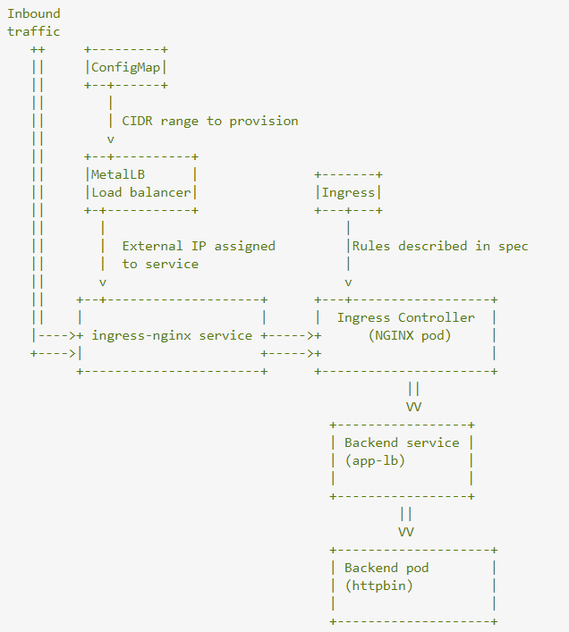

# Guide K8s installation

### Architecture

The architecture of the cluster built at the current version is composed of one controller and 2 nodes where run all the pods of the application. 


### Install kubernetes on master
For Kubernetes to work, you will need a containerization engine. For this installation, we will use docker as it is the most popular.

The following steps will run on the Master-Node.

## Step 1: Prepare Hostname, Firewall and SELinux
On your master node, set the hostname and if you don’t have a DNS server, then also update your /etc/hosts file.

```
hostnamectl set-hostname master-node

cat <<EOF>> /etc/hosts
10.11.6.188 master-node
10.11.6.187 otp-dev-node1
10.11.6.185 otp-dev-node2
EOF
```
You can ping node-1 and -node-2 to test if your updated hostfile is fine using ping command.

Next, disable SElinux and update your firewall rules.

```setenforce 0
sed -i --follow-symlinks 's/SELINUX=enforcing/SELINUX=disabled/g' /etc/sysconfig/selinux
reboot
```

Set the following firewall rules on ports. Make sure that each firewall-cmd command, returns a success.
```
firewall-cmd --permanent --add-port=6443/tcp
firewall-cmd --permanent --add-port=2379-2380/tcp
firewall-cmd --permanent --add-port=10250/tcp
firewall-cmd --permanent --add-port=10251/tcp
firewall-cmd --permanent --add-port=10252/tcp
firewall-cmd --permanent --add-port=10255/tcp
firewall-cmd –reload
modprobe br_netfilter
echo '1' > /proc/sys/net/bridge/bridge-nf-call-iptables
```
## Step 2: Setup the Kubernetes Repo

You will need to add Kubernetes repositories manually as they do not come installed by default on CentOS 7.

```
cat <<EOF > /etc/yum.repos.d/kubernetes.repo
[kubernetes]
name=Kubernetes
baseurl=https://packages.cloud.google.com/yum/repos/kubernetes-el7-x86_64
enabled=1
gpgcheck=1
repo_gpgcheck=1
gpgkey=https://packages.cloud.google.com/yum/doc/yum-key.gpg https://packages.cloud.google.com/yum/doc/rpm-package-key.gpg
EOF
```

## Step 3: Install Kubeadm and Docker
With the package repo now ready, you can go ahead and install kubeadm and docker packages.

When the installation completes successfully, enable and start both services.
```
yum install kubeadm docker -y
systemctl enable kubelet
systemctl start kubelet
systemctl enable docker
systemctl start docker
```

## Step 4: Initialize Kubernetes Master and Setup Default User
Now we are ready to initialize kubernetes master, but before that you need to disable swap in order to run “kubeadm init“ command.

```
swapoff -a 
```

Initializing Kubernetes master is a fully automated process that is managed by the “kubeadm init“ command which you will run.

```
kubeadm init
```

Initialize Kubernetes Master
You may want to copy the last line and save it somewhere because you will need to run it on the worker nodes.

```
kubeadm join 10.11.6.188:6443 --token 5s6jd3.nkg793vu03oaxw0l --discovery-token-ca-cert-hash sha256:7639aa68748be75992d13f59c98b423e9a3aad35e5af9119f1beb9dabb393784 --v=5
```

Tip: Sometimes this command might complain about the arguments (args) passed, so edit it to avoid any errors. So, you will delete the ‘\’ character accompanying the --token and your final command will look like this.
Having initialized Kubernetes successfully, you will need to allow your user to start using the cluster. In our case, we want to run this installation as root user, therefore we will go ahead and run these commands as root. You can change to a sudo enabled user you prefer and run the below using sudo.

To use root, run:
```
mkdir -p $HOME/.kube
cp -i /etc/kubernetes/admin.conf $HOME/.kube/config
chown $(id -u):$(id -g) $HOME/.kube/config
```

To use a sudo enabled user, run:
```
$ mkdir -p $HOME/.kube
$ sudo cp -i /etc/kubernetes/admin.conf $HOME/.kube/config
$ sudo chown $(id -u):$(id -g) $HOME/.kube/config
```
Now check to see if the kubectl command is activated.

```
kubectl get nodes
```

At this point, you might also notice that the status of the master-node is ‘NotReady’. This is because we are yet to deploy the pod network to the cluster.

The pod Network is the overlay network for the cluster, that is deployed on top of the present node network. It is designed to allow connectivity across the pod.

## Step 5: Setup Your Pod Network

Deploying the network cluster is a highly flexible process depending on your needs and there are many options available. Since we want to keep our installation as simple as possible, we will use Weavenet plugin which does not require any configuration or extra code and it provides one IP address per pod which is great for us.

These commands will be important to get the pod network setup.
```
export kubever=$(kubectl version | base64 | tr -d '\n')
kubectl apply -f "https://cloud.weave.works/k8s/net?k8s-version=$kubever"
```

Setup Pod Network
Setup Pod Network
Now if you check the status of your master-node, it should be ‘Ready’.
```
kubectl get nodes
```
Check Status of Master Nodes
Check Status of Master Nodes
Next, we add the worker nodes to the cluster.

### Setting Up Worker Nodes to Join Kubernetes Cluster

The following steps will run on the worker nodes. These steps should be run on every worker node when joining the Kubernetes cluster.

Step 1: Prepare Hostname, Firewall and SELinux
On your worker-node-1 and worker-node-2, set the hostname and in case you don’t have a DNS server, then also update your master and worker nodes on /etc/hosts file.

```
hostnamectl set-hostname 'node-1'
cat <<EOF>> /etc/hosts

10.11.6.188 master-node
10.11.6.187 node-1 worker-node-1
10.11.6.185 node-2 worker-node-2
EOF
```

You can ping master-node to test if your updated hostfile is fine.

Next, disable SElinux and update your firewall rules.
```
setenforce 0
sed -i --follow-symlinks 's/SELINUX=enforcing/SELINUX=disabled/g' /etc/sysconfig/selinux
```
Set the following firewall rules on ports. Make sure that all firewall-cmd commands, return success.
```
firewall-cmd --permanent --add-port=6783/tcp
firewall-cmd --permanent --add-port=10250/tcp
firewall-cmd --permanent --add-port=10255/tcp
firewall-cmd --permanent --add-port=30000-32767/tcp
firewall-cmd  --reload
echo '1' > /proc/sys/net/bridge/bridge-nf-call-iptables
```
## Step 2: Setup the Kubernetes Repo into worker node
You will need to add Kubernetes repositories manually as they do not come pre-installed on CentOS 7.
```
cat <<EOF > /etc/yum.repos.d/kubernetes.repo
[kubernetes]
name=Kubernetes
baseurl=https://packages.cloud.google.com/yum/repos/kubernetes-el7-x86_64
enabled=1
gpgcheck=1
repo_gpgcheck=1
gpgkey=https://packages.cloud.google.com/yum/doc/yum-key.gpg https://packages.cloud.google.com/yum/doc/rpm-package-key.gpg
EOF
```

## Step 3: Install Kubeadm and Docker into worker node
With the package repo now ready, you can go ahead and install kubeadm and docker packages.
```
yum install kubeadm docker -y 
```
Start and enable both the services.
```
systemctl enable docker
systemctl start docker
systemctl enable kubelet
systemctl start kubelet
```

## Step 4: Join the Worker Node to the Kubernetes Cluster
We now require the token that kubeadm init generated, to join the cluster. You can copy and paste it to your node-1 and node-2 if you had copied it somewhere.
```
kubeadm join 10.11.6.188:6443 --token 5s6jd3.nkg793vu03oaxw0l --discovery-token-ca-cert-hash sha256:7639aa68748be75992d13f59c98b423e9a3aad35e5af9119f1beb9dabb393784 --v=5
```

Join Nodes to Kubernets Cluster
As suggested on the last line, go back to your master-node and check if worker node-1 and worker node-2 have joined the cluster using the following command.

```
 kubectl get nodes
```

Check All Nodes Status in Kubernetes Cluster
If all the steps run successfully, then, you should see node-1 and node-2 in ready status on the master-node.

At this point, we have successfully completed an installation of a Kubernetes cluster on Centos 7 and we have successfully on-boarded two worker-nodes. You can now begin to create your pods and deploy your services.

## Add a node to an existing cluster
Repeat the steps above for the first worker node. If the tocken gets expired recreate it from controller:

```
kubeadm token create
```

## Deployment of Pods, Services
We are going to be using the kubectl command on master node to create all the pods, deployments and services throught the nodes

### UI and Server 
The first step, of course, is to go ahead and create a yaml file locally. The two yaml files related to the UI (one for mobimart project and another for liguria project whose images are pullable from here: https://hub.docker.com/repository/docker/liguria/travelplanner-ui and https://hub.docker.com/repository/docker/mobimart/travelplanner-ui respectvely) are available on git: https://git.liguriadigitale.it/Mobimart/Kubernetes/src/branch/master/app

Save the file, and tell Kubernetes to create its contents using the CLI:

```
kubectl create -f uiMobimart.yaml
pod "uiMobimart" created
service "uiMobimart" created
```

Again, do the same for ui related to Liguria project:
```
kubectl create -f uiLiguria.yaml
pod "uiLiguria" created
service "uiLiguria" created
```

The following command is equivalent to create:
```
kubectl apply -f "uiMobimart.yaml"
```

You can see that if you ask for a list of the pods:
```
kubectl get pods
```
If you check early enough, while K8s is still deploying, you can see that the workload is still being created. After a few seconds, you should see the pods running.

Ultimately we want to delete a Kubernetes Deployment example, so let’s go ahead and delete it so there aren’t any name conflicts.
```
kubectl delete pod uiMobimart
pod "uiMobimart" deleted
```

To track down any problems on Pods, we can ask Kubernetes for more information on the Pod:
```
kubectl describe pod ui-<casual_number>
```

Samething for otp server.
```
kubectl create -f otp.yaml
deployment "otp" created
service "otp" created
```

To see how it’s doing, we can check on the deployments list:

```
kubectl get deployments
NAME       DESIRED   CURRENT   UP-TO-DATE   AVAILABLE   AGE
ui         2         2         2            1           7s
```
As you can see, Kubernetes has started replicas, if only one is available you can check the event log by describing the Deployment:

```
kubectl describe deployment ui
```

Another few seconds, and we can see that both Pods are running:

```
kubectl get deployments
```

When data change or wanna update the ui, make sure to upload the updated image on dockerhub so that when restarting the pod and service, by symply deleting the yaml as just seen, K8s will pull the newer image and deploy it again. 

For Otp, the only thing could change are data. The server gets those data when building the docker image. Just make sure to launch the script:

```
prepareOtpServer.sh
```  
inside the machibe otp-dev-node1.regione.liguria.it

and available at https://git.liguriadigitale.it/Mobimart/OpenTripPlanner/src/branch/master/prepareOtpServer.sh


### Expose Pods by creating the Services

Now that you have a continuously running, replicated application you can expose it on a network. Before discussing the Kubernetes approach to networking, it is worthwhile to contrast it with the "normal" way networking works with Docker.

By default, Docker uses host-private networking, so containers can talk to other containers only if they are on the same machine. In order for Docker containers to communicate across nodes, there must be allocated ports on the machine's own IP address, which are then forwarded or proxied to the containers. 

In theory, you could talk to these pods directly, but what happens when a node dies? The pods die with it, and the Deployment will create new ones, with different IPs. This is the problem a Service solves.

A Kubernetes Service is an abstraction which defines a logical set of Pods running somewhere in your cluster, that all provide the same functionality. When created, each Service is assigned a unique IP address (also called clusterIP). This address is tied to the lifespan of the Service, and will not change while the Service is alive. Pods can be configured to talk to the Service, and know that communication to the Service will be automatically load-balanced out to some pod that is a member of the Service.

The service connected to all pods will be exposed over 30655. In order to expose the service on the wanted port, the parameter NodePort is fondamental inside the recipe yaml. Otp will be exposed on the 4444 port, for example. 

```
kubctl get services

NAME         TYPE        CLUSTER-IP     EXTERNAL-IP   PORT(S)           AGE
kubernetes   ClusterIP   10.96.0.1      <none>        443/TCP           7d1h
otp           NodePort    10.102.16.29   <none>        44444:4444/TCP    44m
```

And the stuck will be available on the nodes of the cluster at specified ports. 
NB For this creation to be successful the images specified in the yaml file have to be pullable from a registry.

### Pelias geocoder deployments and services
In order to create pelias deployment and services just launch the script:

```
launchPelias.sh
```
inside the kubernetes/app/pelias folder. 
which is going to launch the old docker compose file obtained from conversion in k8s in yaml as explained in the following paragraph.  

#### Convert docker-compose of PELIAS Geocoder in kubertes yaml deployments and service files

Just go to the directory of docker-compose.yaml file and launch the following command:
```
kompose --volumes hostPath --file docker-compose.yml convert
```
If kompose is not existing just:
```
curl -L https://github.com/kubernetes-incubator/kompose/releases/download/v0.7.0/kompose-linux-amd64 -o kompose
```

#### Pelias preparation on nodes:

The preparation (import, downloadd, configuration) of pelias files on the host is a requirement to have a fully functional pelias on the node. 
For the first time usage of node without pelias, just clone the repo:
https://git.liguriadigitale.it/Mobimart/geocoder.git
and follow the README. Basically, follow the  steps in the following scripts for creating the needed folders and give proper permissions, as well as creating all the necessaty files for pelias:
https://git.liguriadigitale.it/Mobimart/geocoder/src/branch/master/createPelias.sh;

https://git.liguriadigitale.it/Mobimart/geocoder/src/branch/master/projects/liguria/launchGeocoder.sh

After everything is done, launch the script:
```
/launchPelias.sh
```
from inside the directory /otp/mobimart/kubernetes/app/pelias

#### Pelias update
In order to update pelias by changing the pelias.json file (which must be present in each node at path: /otp/mobimart/geocoder/docker/project/liguria), simply restart the pelias pods and services from inside the directory /otp/mobimart/kubernetes/app/pelias:

```
kubectl delete -f compose-pelias.yaml
./launchPelias.sh
```
If want to update data on pelias, just change the pelias.json file properly. 
For example, say you wanna update data coming from csv addresses, then just fill the download section of csv field in the pelias.json file and shutdown the pelias stuck with the above command. Now we have to modify the pelias' data on the host because kubernetes is reading from the schema created locally. As said at the beginning, the installation of components has to be done locally: this means that each node has to have all pelias data locally on the path specified in the .env file (in our case /data/pelias/liguria/). 
So, on each node, change pelias.json, shutdown the pelias stuck and launch the commands as 1000 user:
```
pelias elastic start
pelias download csv
pelias import csv
```

The above commands will update the schema. Try launching the docker-compose stuck with the following command, just to make sure the schema gets populated and the other components get to interact:
```
pelias compose up
```

After everything is up&runnig, shutdown the docker stuck in every node:
```
pelias compose down
``` 
and start the k8s stuck from the controller:

```
./otp/mobimart/kubernetes/app/pelias/launchPelias.sh
```

## Install Metal LB, Ingress Control and Ingress Resource

Ingress exposes HTTP and HTTPS routes from outside the cluster to services within the cluster. Traffic routing is controlled by rules defined on the Ingress resource.
An Ingress may be configured to give Services externally-reachable URLs, load balance traffic, terminate SSL / TLS, and offer name-based virtual hosting. An Ingress controller is responsible for fulfilling the Ingress, usually with a load balancer, though it may also configure your edge router or additional frontends to help handle the traffic.

For installing Metallb create with kubectl the files: metallb.yaml, metallb-configmap.yaml.
It's easier to think about Ingress object as of ConfigMap, rather than Service.

MetalLB takes configuration you provided in ConfigMap and waits for IP request API call. When it gets one it provides IP form the CIDR range specified.

In a similar way, ingress controller (NGINX in your case) takes configuration described in Ingress object and uses it to rout traffic to desired place in the cluster.

Then ingress-nginx service is exposed outside of the cluster with assigned IP.

Inbound traffic is directed by Ingress controller (NGINX), based on rules described in Ingress object to a service in font of our application.



An Ingress does not expose arbitrary ports or protocols. Exposing services other than HTTP and HTTPS to the internet typically uses a service of type Service.Type=NodePort or Service.Type=LoadBalancer


## Kubernates Dashboard

#### Install K8s Dashboard 
Deploy the Kubernetes dashboard using Kubectl:
```
kubectl apply -f https://raw.githubusercontent.com/kubernetes/dashboard/v2.0.0-beta8/aio/deploy/recommended.yaml
```

You can access Dashboard using the kubectl command-line tool by running the following command:
```
kubectl proxy --address='0.0.0.0' --accept-hosts='^*$' &
```
Kubectl will make Dashboard available at: 
```
https://mobimart-k8sui.regione.liguria.it/api/v1/namespaces/kubernetes-dashboard/services/https:kubernetes-dashboard:/proxy/#/overview?namespace=default
```

#### Creating a Service Account

Currently, Dashboard only supports logging in with a Bearer Token
We are creating Service Account with name admin-user in namespace kubernetes-dashboard first.

```
kubectl create serviceaccount dashboard-admin-sa
```

This will create a service account named dashboard-admin-sa in the default namespace.
Next bind the dashboard-admin-service-account service account to the cluster-admin role.

```
kubectl create clusterrolebinding dashboard-admin-sa 
--clusterrole=cluster-admin --serviceaccount=default:dashboard-admin-sa
```

When we created the dashboard-admin-sa service account Kubernetes also created a secret for it.
List secrets using:

```
kubectl get secrets
```

We can see the dashboard-admin-sa service account secret in the above screenshot above.
Use kubectl describe to get the access token:
```
kubectl describe secret dashboard-admin-sa-token-<token_number>
```

Now copy the token printed:

```
eyJhbGciOiJSUzI1NiIsImtpZCI6Im5YOXdaOTFQd2NReEdlRDZkSGRxemt5UlVrcUtzU1VKTDQ2VURiY2stZlUifQ.eyJpc3MiOiJrdWJlcm5ldGVzL3NlcnZpY2VhY2NvdW50Iiwia3ViZXJuZXRlcy5pby9zZXJ2aWNlYWNjb3VudC9uYW1lc3BhY2UiOiJkZWZhdWx0Iiwia3ViZXJuZXRlcy5pby9zZXJ2aWNlYWNjb3VudC9zZWNyZXQubmFtZSI6ImRhc2hib2FyZC1hZG1pbi1zYS10b2tlbi01NWd4OCIsImt1YmVybmV0ZXMuaW8vc2VydmljZWFjY291bnQvc2VydmljZS1hY2NvdW50Lm5hbWUiOiJkYXNoYm9hcmQtYWRtaW4tc2EiLCJrdWJlcm5ldGVzLmlvL3NlcnZpY2VhY2NvdW50L3NlcnZpY2UtYWNjb3VudC51aWQiOiJmZTNjNDRlNi1hN2JmLTRmZjMtOTZmYi02MTVlZjI5NWY5N2QiLCJzdWIiOiJzeXN0ZW06c2VydmljZWFjY291bnQ6ZGVmYXVsdDpkYXNoYm9hcmQtYWRtaW4tc2EifQ.X4mPGSqrXz0JMD2van3fM8mqzdUeh8rdbr3_6wKg0OdRYP4YF59Kql9KR1uRaZ3NpqnIZOPyoH0By4a9W4SbldXeZneODLuL3A8jQTpakJjE4KGtSFdTUF6qBaGN1W50ItmDKKGBdfyQAMEAf3FYFwL6aSL8VrhKa6szeudX9rgpgqt0YWPQgmhkIQHGISzTWS7VfW_YRXo8HpBrd9ehULu5HccWfW37ncvcey-l4JTspZ8GjOCrovqP5luGABxSKHJZDjzpJhczoPNZxvnfp6MFlZkuVSyjjDb1UjgKuOJbwlH9TFM9i4flokRNBdmRq8fgfzLkUV0ngAT4ZCvtJQ
```

and paste it into 'Enter token field' on the login screen.
Click Sign in button and that's it. You are now logged in as an admin.

#### Clean up and next steps

Remove the admin ServiceAccount and ClusterRoleBinding.
```
kubectl -n kubernetes-dashboard delete serviceaccount admin-user
kubectl -n kubernetes-dashboard delete clusterrolebinding admin-user
```

## Useful Commands
```
kubectl get pods --all-namespaces
journalctl -xeu kubelet
systemctl status kubelet
kubectl get deployments -o wide 
kubectl get pods -o wide
kubectl get services -o wide

```

## Troubleshooting

Network: The connection to the server localhost:8080 was refused 
To start using your cluster, you need to run (as a regular user):
```
sudo cp /etc/kubernetes/admin.conf $HOME/
sudo chown $(id -u):$(id -g) $HOME/admin.conf
export KUBECONFIG=$HOME/admin.conf
```

The connection to the server <host>:6443 was refused - did you specify the right host or port?

```
sudo -i
swapoff -a
exit
```

#### Reset Control Plane
```
iptables -F && iptables -t nat -F && iptables -t mangle -F && iptables -X

kubeadm reset 
and before you re-bootstrap the node 
kubeadm init
```

#### Container stuck in creating...
```
go get -d github.com/containernetworking/plugins
cd ~/go/src/github.com/containernetworking/plugins
./build_linux.sh
sudo cp bin/* /opt/cni/bin/ 
```

#### Problems with apps of the stuck
If some app is not responding a first way to debug on kubernetes is checking on the specific pod and deployment what the problem might be by using commands like:
```
kubectl get pods -o wide 
kebectl describe pod  <pod-number-listed-above>
``` 
the above commands give an idea of where the app has been deployed and what happened to the pod.  
If want to investigate at the container level just take note of the node where the specific app has been deployed and, from inside the node, just launch:

```
docker ps
docker logs -f <id-container>
``` 

#### Totally unistall kubernetes from Centos
```
sudo docker rm `docker ps -a -q`
sudo docker rmi `docker images -q`
iptables -F && iptables -t nat -F && iptables -t mangle -F && iptables -X
sudo kubeadm reset 
rm -rf /etc/cni/net.d
rm -rf $HOME/.kube/config
sudo yum remove kubeadm kubectl kubelet kubernetes-cni kube*    
sudo yum autoremove 
sudo rm -rf ~/.kube
```
